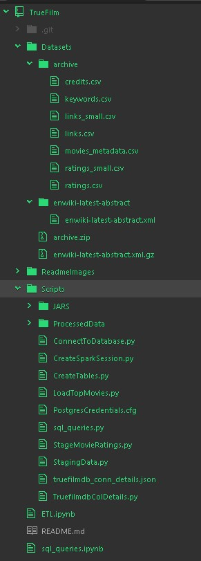
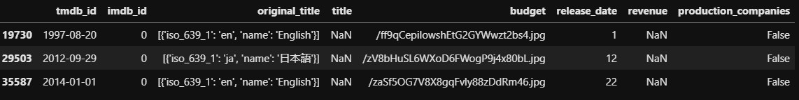

# TrueFilm Challenge

## Introduction
TrueFilm is a film investment company. They fund new projects,with the goal of taking a share of any profits. In the past these decisions were made on gut feeling, but as the industry becomes more and more competitive they would like to become more data driven. They believe that by understanding which films have performes well in the past, they can make better decisions.

## Task
Create analysis platform, combining following data sources :
1. Datasets from Kaggle : [The Movies Datasest (228MB)](https://www.kaggle.com/rounakbanik/the-movies-dataset/version/7#movies_metadata.csv)
2. Wikipedia movies dump : [Wikipedia Dumps (700MB)](https://dumps.wikimedia.org/enwiki/latest/enwiki-latest-abstract.xml.gz)

## Requirements
1. *python* [Download](https://www.python.org/downloads/release/python-379/)
2. *pip* [pip installation guide](https://pip.pypa.io/en/stable/installing/)
3. *pandas* [pandas installation guide](https://pypi.org/project/pandas/)
4. *psycopg2* [psycopg2 installation guide](https://pypi.org/project/psycopg2/)
5. *pyspark & hadoop* [Guide to install locally](https://www.datacamp.com/community/tutorials/installation-of-pyspark)
6. *findspark*
  Install Python findspark library to be used in standalone Python script or Jupyter notebook to run Spark application outside PySpark.
  ```
  pip install findspark
  ```
7. *postgres* [Download & Install guide](https://www.postgresql.org/download/)
8. Jar-Files
  - **Spark-XML package Jar file** [Select here](https://mvnrepository.com/artifact/com.databricks/spark-xml)
      - [More details on this package](https://github.com/databricks/spark-xml)
  - **PostgreSQL JDBC Driver** [Select here](https://jdbc.postgresql.org/download.html)

**NOTE** that, Spark 2.x is pre-built with Scala 2.11 except version 2.4.2, which is pre-built with Scala 2.12. Spark 3.0+ is pre-built with Scala 2.12.

**NOTE** Please ensure that PATH - Environment variable is updated with these installations.
### Versions used in this project
- **OS** Windows 10
- **Java** jdk1.8.0_241
- **python** Python 3.7.9
- **postgres** psql (12.2)
- **pyspark & hadoop** spark-2.4.6-bin-hadoop2.7 [Download](https://spark.apache.org/downloads.html)
- **Spark-XML package Jar file** spark-xml_2.11-0.11.0.jar (This is used for processing Wikipedia XML dump)
- **PostgreSQL JDBC Driver** postgresql-42.2.18.jar (Driver to connect PostgreSQL from pyspark)

## How to run
### Setup : Dataset Download & extraction
1. Make a folder with some name, say TrueFilmProject.
2. Download the above folders into TrueFilmProject.
3. Download datasets into *Datasets* folder
  - Kaggle - Extract into folder `Datasets/archive/`
  - Wikipedia - Extract into folder `Datasets/enwiki-latest-abstract/`

  

**NOTE** : This program needs Read & Write permissions for Scripts folder and Read permissions for Datasets folder

### Setup : Configurations
#### PostgreSQL Configurations
Enter your postgres configuration details into the following files :
 1. `PostgresCredentials.cfg` - Your postgres DB username & password details
 2. `truefilmdb_conn_details.json` - true_film_db is the database that will be created by this project.

You need to specify : `username`\*, `password`\*, `host`\* & `port`\* details in both files.

**\*** These credentials should be modified according to your postgres server.
#### PySpark Configuration
Place downloaded Jar-Files **Spark-XML package Jar file** & **PostgreSQL JDBC Driver** in a folder.
Override jar file entries in `CreateSparkSession.py` file with above paths.
```python:
jars = [
                "Scripts/JARS/postgresql-42.2.18.jar",
                "Scripts/JARS/spark-xml_2.11-0.11.0.jar",
        ]
```
**NOTE** If using same version as above, jar files are included in project and paths need not change.

If using distributed systems, you can modify Spark session builder in `CreateSparkSession.py` accordingly.
```python:
            spark = SparkSession.builder.master("local").config(conf=conf).getOrCreate()
```
### RUN
Following commands need to be run from `TrueFilmProject` folder only.
* Step-1 :
Run following command :
```shell:
TrueFilmProject> python Scripts/CreateTables.py
```
This will connect to your postgres database and creates `true_film_db database`\* inside it.
After creating true_film_db\*\* it will create required tables for this project.

\* **NOTE** : It will drop the database and tables if they already exist.
\*\* Database name is hard coded in scripts, but can be made configurable as well.

* Step-2 :
Run following command :
```shell:
TrueFilmProject> python Scripts/StagingData.py
```
This command will process input data from `movies_metadata.csv`, `links.csv` & `links_small.csv`.
Cleaned data from input files is dumped into a csv files, which are then bulk loaded into DB.
Loads cleaned data into `true_film_db.movies_metadata` and `true_film_db.movie_links` tables.

* Step-3 :
Run following command :
```shell:
TrueFilmProject> python Scripts/StageMovieRatings.py
```
This will process input data from `ratings.csv` and `ratings_small.csv`.
Cleaned and aggregated data from input files is loaded directly into `true_film_db.movie_ratings` table.

* Step-4 :
Run following command :
```shell:
TrueFilmProject> python Scripts/LoadTopMovies.py
```

## Why tools were chosen
Pandas Usage :
I have used pandas python library in `Srcipts/StagingData.py`.
This is used to process data from `movies_metadata.csv`, `links.csv` & `links_small.csv`. Choice of using pandas for it is because of the following reasons :
1. There were no aggregation operations necessary while processing them
2. Identifying bad records is simpler using pandas
3. These file sizes were manageable for simple processing in pandas

**NOTE** Bad Records from csv files are the ones with misplaced column values.
Sample bad records:



Pyspark:
I have used pyspark for processing data from `ratings.csv` and `ratings_small.csv`. This was primarily because of the type of data. A user can give ratings to multiple movies, this creates a Many -to- Many relationship between Movies and Ratings. We need to **aggregate** all user ratings for a movie and  calculate a rating we can use in tables.
Pyspark was also used for processing information from Wikipedia xml files.  This was because of **huge size** of the XML file I had to process.
To make it generic and extensible, creating final table with top 1000 movies was also done in pyspark.

PySpark was choosen to process these because of following reasons:
1. **aggregate** operations are compute heavy
2. Processing **huge size** files

Both of above operations like merging or grouping of data require parallelization and distributed computing. These operations are very slow and quite expensive and become difficult to handle with a Pandas dataframe, which does not support parallel processing.
`StageMovieRatings.py` and `LoadTopMovies.py` both uses pyspark for processing data.

3. Postgres:
Staged KAGGLE datasets into Postgres Database as this data is structured and some kind of relationships can be formed between them. Staging data will make easy to backtrack if any data mismatch occurs during analysis.

### Overview of Scripts used
1. `CreateTables.py` - This will create `true_film_db` database along with required `tables`
2. `StagingData.py` - This will process `links.csv`,`links_small.csv` & `movies_metadata.csv`,  and write the data into following `csv` respectively. These files are then bulk loaded into Postgres using `copy_expert`
            * `Scrtipts/ProcessData/movie_links.csv` - **true_film_db.movie_links**
            * `Scrtipts/ProcessData/movies_data.csv` - **true_film_db.movies_metadata**

3. `StageMovieRatings.py` -  This will process `movie_ratings.csv` and load into postgres table **true_film_db.movie_ratings** using JDBC
4.  `LoadTopMovies.py` - Processes Wikipedia Abstract, this xml data is joined with above tables loaded in postgres. With the joined data ratio is calculated and top 1000 records are extracted and loaded into final table **true_film_db.top_movies**

#### Other files in Scripts
* `PostgresCredentials.cfg` - PostgresDB connection details
* `truefilmdb_conn_details.json` - `true_film_db` connection details
* `sql_queries.py` - contains SQL queries for drop, create and copy statements for true_film_db tables
* `TruefilmdbColDetails.py` - Required columns and Datatypes from the Datasets are specified in this file
*  `ConnectToDatabase.py` - This will cerate a connection to PostgresDB
* `CreateSparkSession.py` - This will load required JARS and create spark session.

## Testing for correctness
While doing this exercise, correctness was ensured by visual means and looking for root-cause of any errors while extracting, transforming and loading data from input datasets.

### Bad records
I had found bad records while processing `movies_metadata.csv`, `links.csv` & `links_small.csv`. This was identified when loading them into Pandas dataframes. These are processed by python Scripts/StagingData.py.
Identification of bad records is done using a python *staticmethod*. We can also add unit-tests for this function to enhance quality.
As an extension, Bad records can be saved into a file for analysis.

### Null Values
Null values were handled by providing default values, I have used negative values `-9999` for integers and `-999.999` for floating points. Ratio calculation is done only if revenue is greater than 0, thus excluding bad and un-wanted records.

### SQL Query checks
At different stages, I had executed some SQL queries on Tables and did some manual checks that values are as expected.

## How to query data
I have attached a Jupiter Notebook with SQL Queries in **`sql_queries.ipynb`**

**`TrueFilmDB_TablesStructure`** - This book has all table structures created for this project in Postgres DB

Jupiter notebooks can be installed from [here](https://jupyterlab.readthedocs.io/en/stable/getting_started/installation.html) or can be directly viewed on GitHub.
